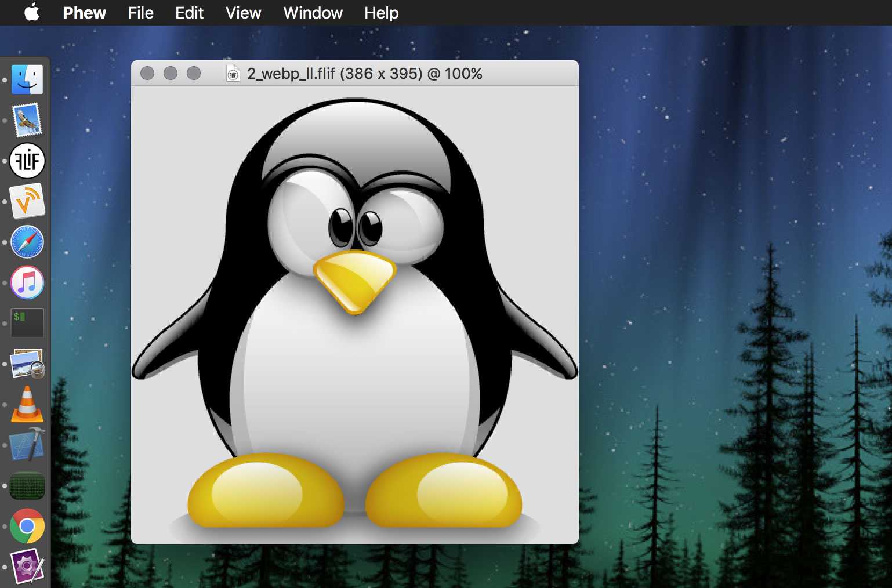
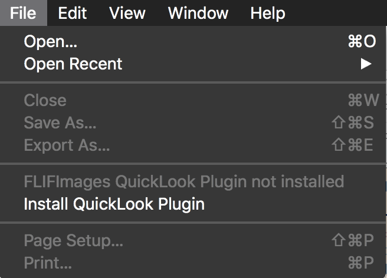
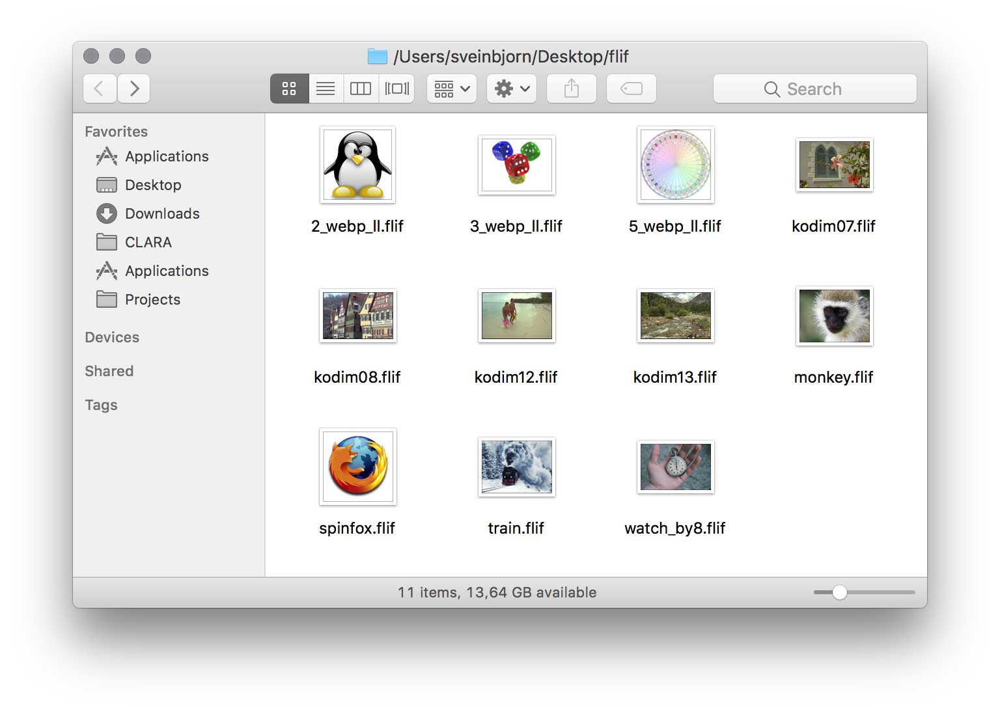
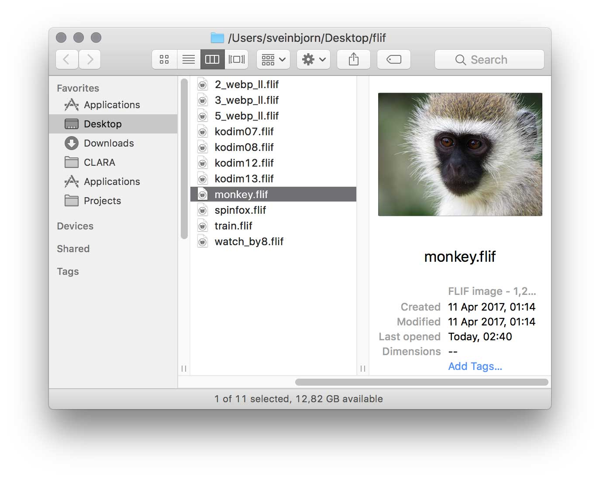
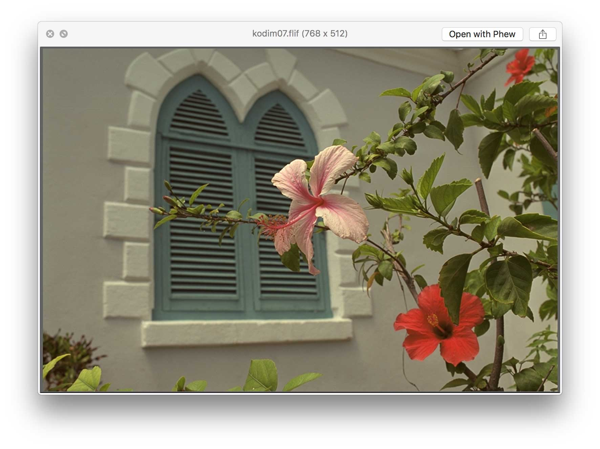

# Phew - FLIF Image Viewer for macOS

**Phew** is an open-source <a href="http://flif.info">FLIF</a> image viewer and QuickLook plugin for macOS.

The <strong><a href="http://flif.info">Free Lossless Image Format</a></strong> or <strong>FLIF</strong> is a novel lossless image format which outperforms PNG, lossless WebP, lossless BPG, lossless JPEG2000, and lossless JPEG XR in terms of compression ratio.

Phew can open and display FLIF images, and can export them as PNG, TIFF, BMP or raw pixel data. If the accompanying QuickLook Plug-In is installed, FLIF images show thumbnails and previews in the Finder and Spotlight just like regular images.

* **[Download Phew 1.0](http://sveinbjorn.org/files/software/phew/Phew-1.0.zip)** (Intel 64-bit, macOS 10.10 or later, ~1.7 MB)

The Phew source code contains the <code>FLIFImage</code> class, which is an Objective-C wrapper to easily read images in the FLIF format via <code>libflif</code>. This class is available via <a href="https://cocoapods.org">CocoaPods</a>. See below for further info.

## Screenshots

## FLIFImage Objective-C Class

<code>FLIFImage</code> is an Objective-C wrapper to easily read images in the FLIF format via <code>libflif</code>, the official FLIF reference decoder implementation. You can install via <a href="https://cocoapods.org">CocoaPods</a>. 

FLIFImage exposes the following class methods:

    + (BOOL)isFLIFImageAtPath:(NSString *)path;
    + (BOOL)isFLIFImageData:(NSData *)data;

    + (NSImage *)newImageFromFLIFImageFileAtPath:(NSString *)path;
    + (CGImageRef)newCGImageFromFLIFImageFileAtPath:(NSString *)path;

    + (NSImage *)newImageFromFLIFData:(NSData *)data;
    + (CGImageRef)newCGImageFromFLIFData:(NSData *)data;

Those calling <code>newCGImage*</code> methods are themselves responsible for releasing the returned CGImageRef.

## License

Phew uses <a href="https://github.com/FLIF-hub/FLIF"><code>libflif</code></a>, which is distributed under the 
<a href="http://www.gnu.org/licenses/gpl.html">GNU Lesser General Public License</a> (LGPL), version 3 or later. Phew itself is also open source software, available under the three-clause BSD license:

> Copyright (c) 2017, Sveinbjorn Thordarson &lt;sveinbjornt@gmail.com&gt;
> 
> Redistribution and use in source and binary forms, with or without modification,
> are permitted provided that the following conditions are met:
> 
> 1. Redistributions of source code must retain the above copyright notice, this
> list of conditions and the following disclaimer.
> 
> 2. Redistributions in binary form must reproduce the above copyright notice, this
> list of conditions and the following disclaimer in the documentation and/or other
> materials provided with the distribution.
> 
> 3. Neither the name of the copyright holder nor the names of its contributors may
> be used to endorse or promote products derived from this software without specific
> prior written permission.
> 
> THIS SOFTWARE IS PROVIDED BY THE COPYRIGHT HOLDERS AND CONTRIBUTORS "AS IS" AND
> ANY EXPRESS OR IMPLIED WARRANTIES, INCLUDING, BUT NOT LIMITED TO, THE IMPLIED
> WARRANTIES OF MERCHANTABILITY AND FITNESS FOR A PARTICULAR PURPOSE ARE DISCLAIMED.
> IN NO EVENT SHALL THE COPYRIGHT HOLDER OR CONTRIBUTORS BE LIABLE FOR ANY DIRECT,
> INDIRECT, INCIDENTAL, SPECIAL, EXEMPLARY, OR CONSEQUENTIAL DAMAGES (INCLUDING, BUT
> NOT LIMITED TO, PROCUREMENT OF SUBSTITUTE GOODS OR SERVICES; LOSS OF USE, DATA, OR
> PROFITS; OR BUSINESS INTERRUPTION) HOWEVER CAUSED AND ON ANY THEORY OF LIABILITY,
> WHETHER IN CONTRACT, STRICT LIABILITY, OR TORT (INCLUDING NEGLIGENCE OR OTHERWISE)
> ARISING IN ANY WAY OUT OF THE USE OF THIS SOFTWARE, EVEN IF ADVISED OF THE
> POSSIBILITY OF SUCH DAMAGE.
